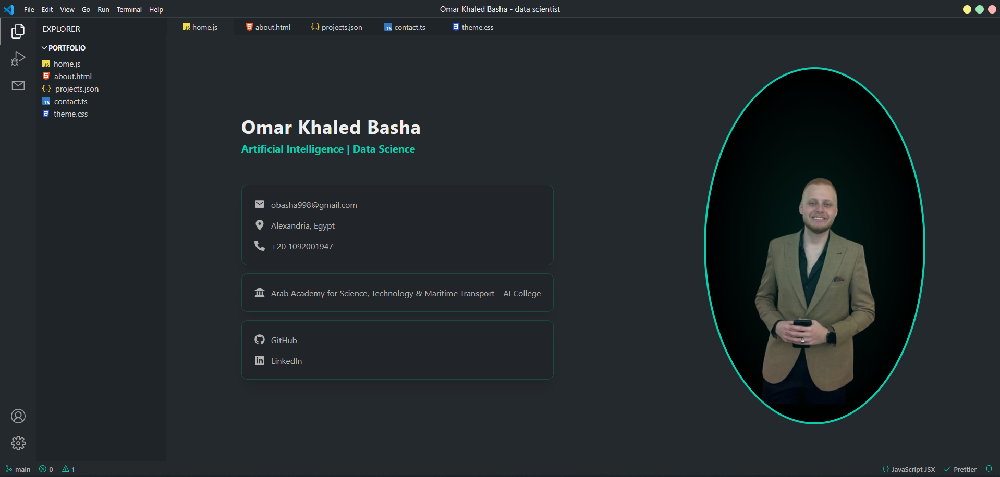

# Omar Khaled Basha's Data Science Portfolio – Visual Studio Code Theme

## Table of Contents

- [Overview](#overview)
  - [Screenshot](#screenshot)
- [My Process](#my-process)
  - [Built With](#built-with)
- [How to Use](#how-to-use)
- [Customize Your Info](#customize-your-info)
- [Deploy on Vercel](#deploy-on-vercel)
- [Contact Integration](#contact-integration)
- [Author](#author)

---

## Overview

This is a personalized portfolio website inspired by Visual Studio Code's interface, built using modern web technologies including **React**, **TypeScript**, and **Chakra UI**.

The purpose of this portfolio is to present **Omar Khaled Basha** — a dedicated **Artificial Intelligence and Data Science student** — through a sleek, developer-oriented layout that showcases both professional and personal strengths.

### 🔍 What’s Inside:

- 🧑‍💼 A professional bio and contact section  
- 📂 A featured projects gallery covering machine learning, AI, and full-stack development  
- 🛠️ A categorized technical skills section  
- 📱 Fully responsive design, ready to deploy via [Vercel](https://vercel.com)

This portfolio is fully customizable and built for developers who want to present their work cleanly, efficiently, and with a touch of personality.

### Screenshot




---

## My Process

### Built With

- [Vite](https://vitejs.dev/)
- [React](https://reactjs.org/)
- [TypeScript](https://www.typescriptlang.org/)
- [Chakra UI](https://chakra-ui.com/)
- [EmailJS](https://www.emailjs.com/) *(optional)*
- [Formik](https://formik.org/)

---

## How to Use

1. **Clone** the repository:
   ```bash
   git clone https://github.com/omarbasha19/Portfolio-Omar-Khaled-Basha.git
   ```
2. Navigate to the project folder:
   ```bash
   cd Portfolio-Omar-Khaled-Basha
   ```
3. Install dependencies:
   ```bash
   npm install
   ```
4. Start the dev server:
   ```bash
   npm run dev
   ```
5. Open [http://localhost:5173](http://localhost:5173) in your browser.

---

## Customize Your Info

- Go to the `/public/data` folder.
- Update these files with your information:
  - `home.ts` → personal image, contact, education, and social links.
  - `about.ts` → bio and skills.
  - `projects.ts` → your real projects and GitHub links.
- Restart dev server to apply:
  ```bash
  npm run dev
  ```

---

## Deploy on Vercel

You can easily deploy this portfolio using [Vercel](https://vercel.com/):

1. Push your project to GitHub.
2. Visit [https://vercel.com/new](https://vercel.com/new).
3. Import your GitHub repository.
4. Follow the prompts and click **Deploy**.

---

## Contact Integration

To enable real-time email sending from the contact form:

- Configure [EmailJS](https://emailjs.com), or
- Deploy your own email API and update:
  ```ts
  /src/utils/sendEmail.ts
  ```

---

## Author

- **Name**: Omar Khaled Basha
- **Email**: obasha998@gmail.com
- **LinkedIn**: [@omar-khaled](https://www.linkedin.com/in/omar-khaled-87378a2ba/)
- **GitHub**: [@omarbasha19](https://github.com/omarbasha19)

---

> This portfolio is a personalized and rebranded version of an open-source template, now reflecting the work and identity of Omar Khaled Basha.
